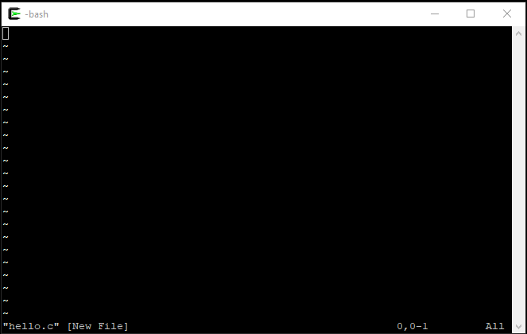

# 
 Math 4610 Lecture Notes A Brief Cygwin Primer 

## 
 Joe Koebbe 

  These notes are part of an
  [Open Educational Resource](https://www.oer.usu.edu)
  project sponsored by Utah State University

**Cygwin Primer for Math 4610 at USU:** Just Some Basic Commands

To install Cygwin on your computer, first find the web site:

    cygwin.org

The following shows what will pop up when you use a browser to get to the site.
There are instructions for downloading and installing the packages you will need
for the course. Your instructor downloads and saves the setup-x86_64.exe file
for an installation on a laptop or desktop. Double click on the file once you
have saved the file. Note that the installation will take a bit of time and
diskspace. There is an image below that shows what the desktop icon looks like.

**Cygwin Primer for Math 4610 at USU:** Getting a Cygwin Terminal Up and Running

Cygwin can be installed on just about any computer. If you are working on a
Linux or Unix system you won't need to install Cygwin. Cygwin can be a huge
storage hog if you install everything in the package. You can install a basic
version that takes up less disk space. Also, the computer lab on the third
floor of the Engineering  Building has Cygwin installed and running if this
option is needed. Once you have a version of Cygwin available, you can double
click the icon on the Desktop or in the list apps on a Windows machine to
obtain a terminal to work in, see below.

**Cygwin Primer for Math 4610 at USU:** List the Contents of the Home Directory 

The first thing to look at is what is in a directory. It is important to know
where you are at in a directory and the like. This also serves as a first linux
or unix command. In the screenshot below there are a couple of versions of a
command that will list files and folders with more or less information. Note
that most linux commands look like the following:

    % command [options] [input parameters]

**Cygwin Primer for Math 4610 at USU:** Directory Commands

You will need to create, move, remove, and other things to directories to keep
work organized. The {\bf mkdir} command allows a persion to create a new
directory in the current working directory. This is the same thing tha Windows
Explorer allows you to do with a popup menu. There will be many places where
a directory structure will be required. You can remove a directory with the
{\bf rmdir} command. The {\bf cd} command can be used to navigate through a
directory structure. Finally, on this screen capture, the {\bf pwd} command is
used to determine the current working directory. This can be used to figure out
where you are in a directory structure.

     % pwd                 current working directory
     % cd                  change working directory
     % mkdir               make a new directory
     % rmdir               remove an existing directory

**Cygwin Primer for Math 4610 at USU:** Which Command 

You will want to know what is available for doing work within Cygwin or any
other platform. The which command will let you know if apps or other executables
are available on your version of Cygwin. In particular, it is important to know
if certain compilers (e.g, javac, gcc, f77) are available. A significant number
of tasks you will be asked to complete will require the use of a compiler and
Cygwin has a number of (good) standard compilers for C, C++, and fortran. The
syntax for the command is the following.

     % which command

**Cygwin Primer for Math 4610 at USU:** A Simple Editing Program 

You will need an editor to create text files. There are a number of editors that
can be downloaded and used in any Cygwin installation. The standard editor that
is always available for linux and unix boxes is "vi". This editor is a bit
rudimentary, but works. Another editor which will be used in by the instructor
in the course is "vim". The syntax for starting the editor in a window is the
following.

      % vim filename

There are a lot of escape sequences it insert text, write a file and so on. If
you are new to vim, you will need to learn at least a few of these editing
commands.

**Cygwin Primer for Math 4610 at USU:** First View of the vim Editor 

Below is what the terminal will turn into when you start up the editor on a new
file. To get out of the editor, you can use any of the following commands inside
the editor.

     :x                  write and exit the editor - saves changes in the file
     :q                  exit the editor if no changes have been made
     :x!                 force a write and exit the editor - saves the file
     :q!                 force an exit of the editor - no changes are saved

Note that there are a few other commands that can be used to save changes. For
example

     :w                  write and stay in the editor
     :w!                 force a write and stay in the editor

**Cygwin Primer for Math 4610 at USU:** An Example of a Text File/Program 

The following screenshot shows a few lines that have been typed into vim that
deinfes a standard hello world example for C. To insert/append characters in the
text file, you can use the following commands to do this. Note that the commands
below do not show up on the screen and the chnages are made where the cursor is
currently located.

     a                     append text at this point in the file
     o                     open a line after the current line
     O                     open a line before the current line

To end adding or inserting text, use the escape character. Again, the commands
will not show up on screen. Learning everything about vi or vim is a time
consuming process. It is one of those things that you figure out as you go.

**Cygwin Primer for Math 4610 at USU:** Compiling a Program

Compiling a program is relatively easy at this point in time. To compile the
program on the previous page you should type in

     % gcc hello.c

The result is an exeutable as seen below. If you want to name the executable
something besides \lq a\rq\ then type the following.

     % gcc -o hello hello.c

**Cygwin Primer for Math 4610 at USU:* Keeping Track of Working Code

It is a good idea to organize your work within assignments and projects. There
is a standard set of folders/directories in linux and unix that most have
adopted. Your instructor follows this idea and usually creates a list of
folders including /src, /data, /bin, and /doc. When computer literate folks see
these folders, they know what is stored in the folders. As an example,

     % mkdir src
     % mkdir bin

can be used and then the executable the text file can be put into /src and the
binary can be copied into /bin. 

