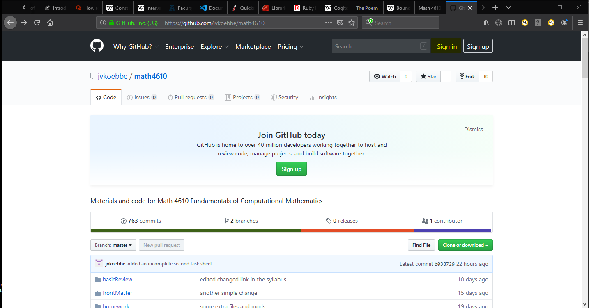
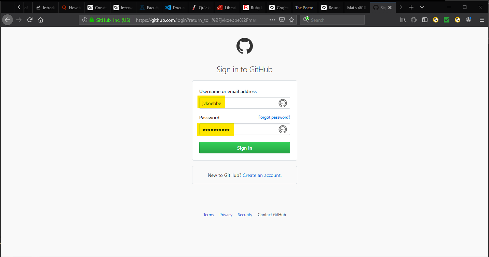
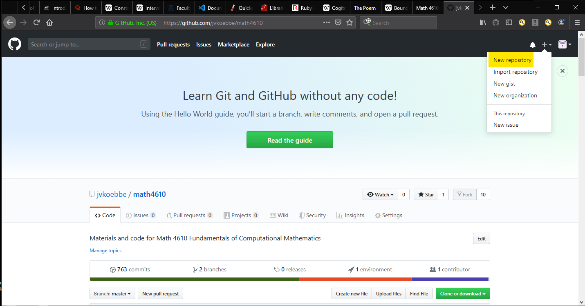
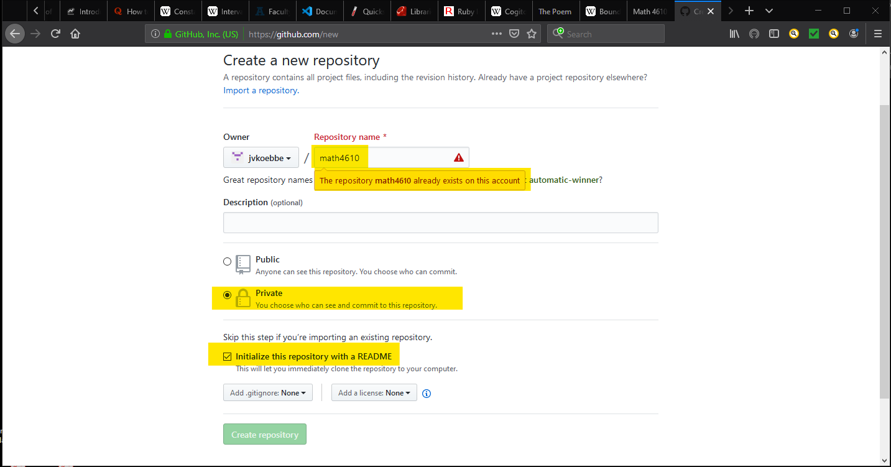
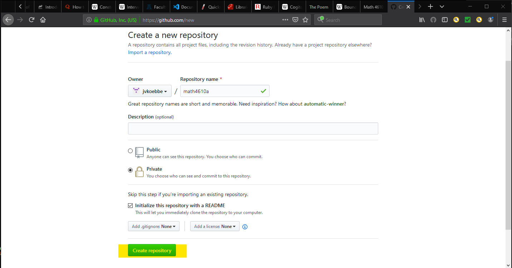

# 
 New Repository Creation Primer 

## 
 Joe Koebbe 

**How to Create a New Repository**

  These notes are part of an
  [Open Educational Resource](https://www.oer.usu.edu)
  project sponsored by Utah State University

To work in this course, students must know how to create and edit a repository.
This brief primer will show students how to create a repository before putting
together the homework repository - this is step 0 in the process.

**New Repository Creation for Math 4610:** Get to Github. 

The first step is to login to your Github account. So, in a web browser, type in

     https://github.com/

and log on to your account. By this point you should already have an account on
Github.

**New Repository for Math 4610: Login to Your Account.** 

Use the popup to login to Github with your user name and password.

**New Repository for Math 4610: Where to Click to Create a New Repository.** 

Click on the menu as shown and then click on the "New Repository" item in the
pull down menu. This will take you to a screen to set the name and other
settings for the repository.

**New Repository for Math 4610: Setting the Name and Other Settings.** 

There are a number of things to be aware of in setting up a repository on
Github. First, there is the name of the repository. As shown, the name typed in
is the following and is highlighted in the figure below.

     math4610

Next you should notice that there is an error message. Your instructor already
has a repository with the chosen name. Notice the

     Create repository

button is not available due to the error message. The third piece of information
is the Public versus Private choice. For a homework repository, this probably
should be a Private repository. Finally, it is always a good idea to start with
a README file in the repository. This acts as a starting point when displayed in
a browser. 

**New Repository for Math 4610: Unique Repsoitory Name Error.**

The following shows a slight modification of the name of the repository. If you
already have a repository for this course, you are already able to edit and
change things in the repository. If not, use the name 

     math4610

In the next part of this lecture, more will be covered in how to edit and modify
any repository that you create.

