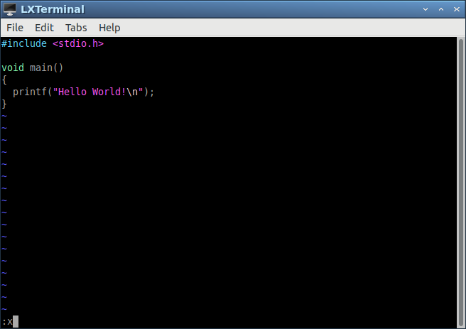
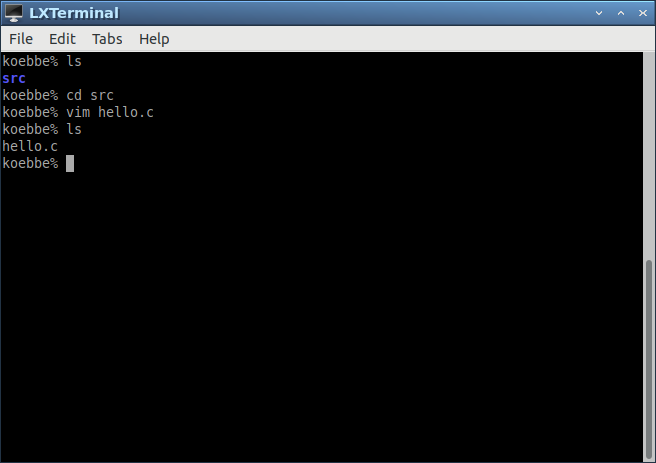
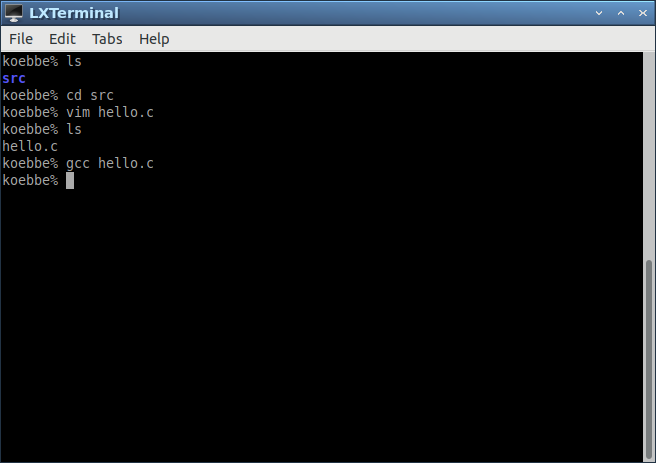
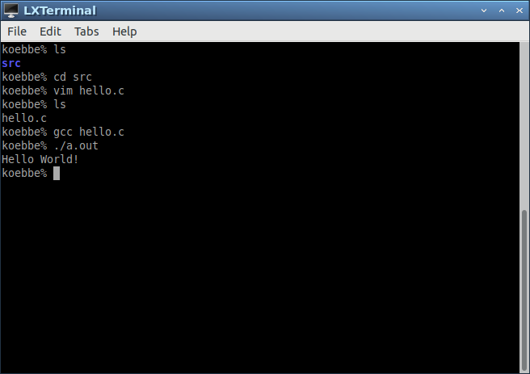
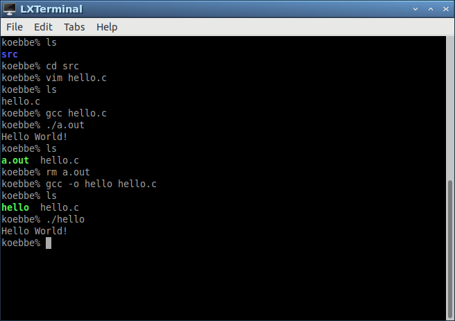
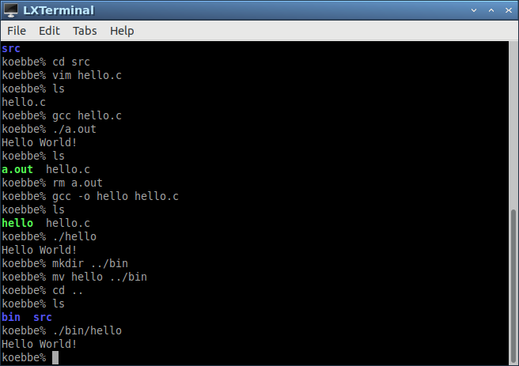

# Math 4610 Fundamentals of Computational Mathematics - Topic 6.

This section will give a simple example of writing a code, compiling a code, and
executing a code in a terminal. First start up a terminal to do the work to
create a file with code in it. For Cygwin, double click on the Cygwin Icon on
your desktop or click on the the icon in the task bar if the app is pinned to
the taskbar.

A terminal as shown below will appear. In these notes, we will create a
directory for each project we build. In addition, we will add in a directory
structure to keep track of source code files and binaries as needed. The project
we will work on is the usual "hello world" code that we all have
seen in programming classes.

So, we will want to create a directory to keep track of the project files and
such. Suppose we want to organize the directory structure that keeps track of
the work we do in Math 4610 and also the projects in the course. Then it would
make sense to have a subfolder for the class, say math4610, and subfolders
contained in math4610 for each project. One way to do this involves a sequence
of three commands.

    koebbe% mkdir math4610
    koebbe% cd math4610
    koebbe% mkdir project

This will create the subfolder, math4610, change the working directory to
math4610 and then make a subfolder named project.

Let's consider the hello world example from the previous topic. The commands
to set this up would be

    koebbe% mkdir math4610
    koebbe% cd math4610
    koebbe% mkdir hello_world 

Most Linux/Unix commands have shortcuts for operations like this. We could just
as easily used the following command to get the same two subfolders.

    koebbe% mkdir -p math4610/hello_world

The -p flag will create parent directories as needed. In our case, if the folder
./math4610 does not exist, the folder will be created and then the
./math4610//hello_world/ is created if it does not already exist. If the parent
folders exist, the command will continue down through the folders. This command
will not change existing files and folders in the folder tree.

To see that this has worked, list the files in the current folder.

    koebbe% ls

Now, let's get to the appropriate folder using the cd or change directory
command.

    koebbe% cd math4610/hello_world

Notice the folder name we are using is a subfolder and the Linux/Unix file
separator is the "/" character between the folder names. In any
case, our terminal session should be in the appropriate subfolder.

Within the project folder, we should try to be organized in the development of
the code. Type in the command shown below to create a new subfolder in the
current directory where we can store the program file we are going to create.

    koebbe% mkdir src

The commands to this point in the process are shown in the following figure.

## Change Directory and Edit

To change the directory, use the command

    koebbe% cd src

Once in the new directory, the next step is to edit a file to implement some
sort of action for the computer. So, to edit a file, type:

    koebbe% vim hello.c

The editor, "vim", is a very standard editor and comes with the
installation of Cygwin.

## Typing in a Program in C with vim

When the vim command is executed, the terminal you are using will look like the
following screenshot. Since the file, hello.c, did not exist, the view that you
see is an empty file ready to be modified.

To get a program into a text file, start by typing in the vim command
"a" to append characters to the file we are creating. The vim
commands will not explicitly show up unless input is needed. The lines in the
terminal shown below define a C program for doing a very simple task. Namely, to
print the string

    Hello World!

to the screen.

## Saving the File and Getting Back to the Command Prompt 

To exit the vim session and save the file, type in a colon character
":" followed by x and return. The terminal will revert to the
command terminal ready to type in commands. The "x" vim command
tells vim to exit the edit session and save the file.

## Making sure the File Exists 

At the command prompt, the first two lines will be as they were to start. The
next command lists the directory and shows the file "hello.c" now
exists in the folder.

## Compiling the Code in C 

After this, the next thing to do is to compile the code. The compiler we will
use is gcc which comes along with Cygwin and many other computer platforms.
That is,

    koebbe% gcc hello.c

will compile the program and create an executable file for you. The last part
below is used to see what is in the directory. The command does not create a
response unless there is an error occurs. This will produce an executable file. If a name is not specified for the executable, gcc produces a file with a
default name, a.out.

## Running the Code 

To run the computer code, use the following command.

    koebbe% a.out

or

    koebbe% ./a.out

The "./" will execute a binary in the current directory.

Once we have an executable file, hello.exe, the code can be run as follows.

    koebbe% ./hello.exe

The output from this command will be as shown in the image below. The output is
printed on the first line.

## Changing the Name of an Executable

Next, let's use an appropriate name for the executable. We can use the mv
command as follows:

    koebbe% mv a.out hello.exe

or we can use a flag on gcc to rename the executable as follows.

    koebbe% rm a.out
    koebbe% gcc -o hello hello.c

This will produce an executable with name "hello" in the current
folder. To test the new executable file we can try

    koebbe% ./hello.exe

to obtain the same result as before.

## A Slight Change to the Directory Structure 

As a personal preference, we might want to put the executable in a place for
executable files. In a lot of Linux/Unix platforms, the folder "bin"
is used to contain all executable files. So, the last thing to do would be to
create a bin folder and place our executable hello.exe in that folder. To that
end we can use the following commands.

    koebbe% mkdir ../bin
    koebbe% mv hello.exe ../bin
    koebbe% cd ..
    koebbe% ls
    koebbe% ./bin/hello.exe

The last command of the three is included to test the binary in its new
location. Since the cd command moves us up one level, the src and bin folders
are a subfolder of hello_world.

[Previous](../../topic_05/md/topic_05.md)
| [Table of Contents](../../toc/pdf/embed_toc.md)
| [Next](../../topic_07/md/topic_07.md)

